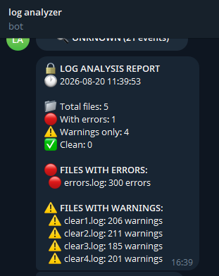
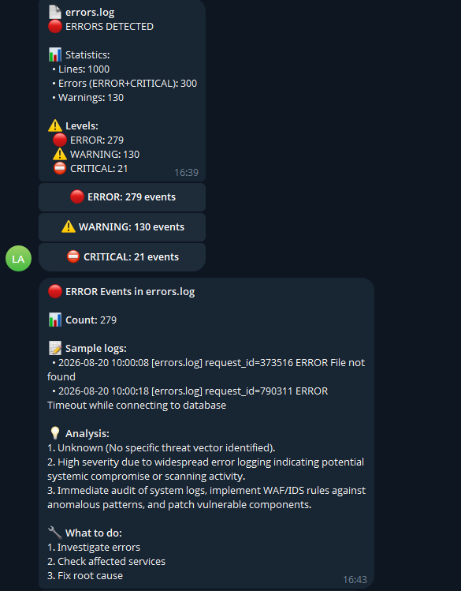

# 🔒 Log Analyzer Telegram Bot

AI-powered log analyzer that sends results to Telegram with interactive buttons.

## What it does

- Upload multiple .log files or ZIP archive
- Analyzes logs using CyberSecQwen-4B AI model
- Detects ERROR, CRITICAL, WARNING events
- Sends summary report to your Telegram
- Interactive buttons for detailed explanations
- Separates files with errors from files with warnings only

## What it doesn't do

- Does not send full log content to Telegram (only summary)
- Does not process files larger than 10000 lines well
- Does not work without GPU (T4 recommended)
- Does not detect all attack types (only common ones)

## Screenshots

Telegram report:



Interactive buttons:


  

## Quick Start

1. Open `main.ipynb` in Google Colab
2. Select Runtime → Change runtime type → GPU T4
3. Insert your bot token and user ID in the settings cell
4. Run all cells
5. Upload your .log files
6. Get report in Telegram

## Bot Setup

Get bot token from @BotFather:
- Send `/newbot` to @BotFather
- Copy the token

Get your user ID from @userinfobot:
- Send any message to @userinfobot
- Copy your ID

Insert here:
```python
BOT_TOKEN = "YOUR_BOT_TOKEN_HERE"
CHAT_ID = "YOUR_USER_ID_HERE"
```
(do not forget about the callback part for buttons)

## Project Structure

```
log-analyzer-tg-bot/
├── main.ipynb           # Main notebook
├── main.py              # Python script
├── requirements.txt     # Dependencies
├── README.md            # This file
└── test_logs.zip        # Test log files
```

## Example Output

```
🔒 LOG ANALYSIS REPORT
🕐 2026-08-20 16:30:00

📁 Total files: 5
🔴 With errors: 1
⚠️ Warnings only: 4
✅ Clean: 0

🔴 FILES WITH ERRORS:
  🔴 errors.log: 300 errors

⚠️ FILES WITH WARNINGS:
  ⚠️ clear1.log: 206 warnings
```

## Tech Stack

- Python 3.8+
- PyTorch
- CyberSecQwen-4B (Hugging Face)
- Sentence-Transformers
- scikit-learn
- Telegram Bot API

## Disclaimer

For educational purposes only. Use on your own logs.
